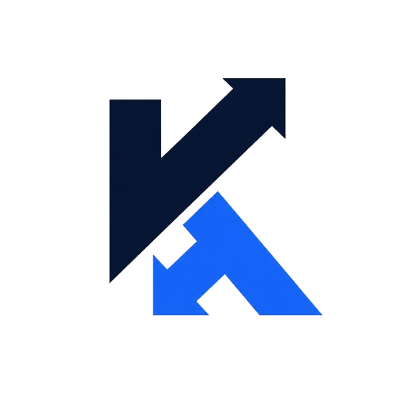

<p align="center">
  
</p>

<h1 align="center">KRedex</h1>

<p align="center"><em>Secure and Easy P2P Lending and Borrowing — Built on Trust.</em></p>

<p align="center">
   
   
   
   
   
   
</p>

<p align="center">✨ Fast. Transparent. Auditable. Global. ✨</p>

<p align="center"><strong>Website:</strong> <a href="https://kredex.vercel.app/">kredex.vercel.app</a></p>
<p align="center"><strong>Community / Updates:</strong> <a href="https://x.com/kredexweb3">𝕏 @kredexweb3</a></p>

---

## 🚀 Something Big is Launching! Stay Tuned!

We are building the future of decentralized peer-to-peer (P2P) lending and borrowing. **KRedex** leverages on-chain behavior and smart contract automation to make capital access secure, easy, and transparent.

### 🌟 What is KRedex?
Traditional credit rails are broken, leaving millions of individuals globally without access to fair financing. KRedex resolves this by introducing a decentralized, reputation-based micro-lending model on Stellar & Soroban.

- **Reputation-First Credit**: Leverage on-chain activities and history instead of traditional collateral.
- **Secure P2P Matching**: Directly connect borrowers with lending liquidity pools under auditable, code-enforced rules.
- **Escrow-Backed Safety**: Protect capital with escrow accounts, default management mechanics, and trust-critical safety controls.

---

## 🛠️ Technology Stack
- **Frontend:** Next.js 16 (App Router), React 19, TypeScript, Tailwind CSS 4
- **Auth & Database:** Supabase Auth, PostgreSQL, Supabase RLS
- **Smart Contracts:** Soroban Smart Contracts (Rust), compiled to WASM

---

## ⚙️ Development Setup

### 1) Prerequisites
- Node.js 18+
- Rust toolchain
- Stellar CLI

### 2) Install dependencies
```bash
npm install
```

### 3) Start development server
```bash
npm run dev
```

### 4) Production build and lint
```bash
npm run build
npm run lint
```

---

## 📂 Project Structure
```text
kredex/
├─ app/                    # Next.js App Router pages, APIs, and actions
├─ components/             # Reusable UI, layouts, and landing page components
├─ contracts/              # Soroban smart contracts (Rust)
├─ lib/                    # Supabase, Stellar SDK, and contract helper clients
├─ public/                 # Static assets (logos, icons)
├─ sql/                    # Supabase database schema and RLS policies
└─ types/                  # Shared TypeScript type definitions
```

---

Done with ❤️ by KRedex Team. Stay tuned for our mainnet release!
