<p align="center">
  
</p>

<h1 align="center">KRedex</h1>

<p align="center"><em>Secure and Easy P2P Lending and Borrowing — Built on Trust.</em></p>

<p align="center">
   
   
   
   
   
   
</p>
<br>

---
<p>
  <strong>Live Platform:</strong> <a href="https://kredex.vercel.app/">https://kredex.vercel.app/</a><br/>

  <strong>Demo Video:</strong> <a href="https://youtu.be/5tPY8XqotMM">https://youtu.be/5tPY8XqotMM</a><br/>

  <strong>Pitch Deck:</strong> <a href="https://drive.google.com/file/d/1pajPQs91IRSjNYJGA9W5hUDOF5UMDevi/view?usp=sharing">View Presentation</a>
</p>

---

## 🛑 The Problem

Traditional credit systems exclude billions of underbanked individuals due to rigid collateral requirements and centralized, high-friction processes. This leads to a massive liquidity gap where capital cannot reach the people who need it most for micro-enterprises, education, and personal growth. Without a traditional credit score, millions are trapped outside the financial system.

## 💡 How KRedex Solves This

**KRedex** decentralizes lending by using **on-chain reputation** instead of over-collateralization. By combining Stellar's low-fee infrastructure, SEP-12 KYC compliance, and Soroban smart contracts, KRedex creates a transparent environment where borrowers build creditworthiness over time based on their real repayment history. Lenders are protected through escrow contracts, dynamic risk models, and automated defaults, allowing seamless and secure peer-to-peer liquidity.

## 🌍 Real World Example

A small business owner in an emerging market needs $500 for inventory but lacks traditional bank collateral. Through KRedex, they verify their identity (KYC) and borrow smaller amounts first (e.g., $50). As they repay on time, their on-chain reputation score increases, unlocking the $500 loan with lower interest rates. Meanwhile, a lender on the other side of the world funds this loan directly, earning a solid yield on their capital with full blockchain transparency.

## 💼 Business Model & Advantages

**How KRedex Earns:** 
The platform generates revenue by charging a small protocol fee (e.g., 1-2%) on successfully funded loans and a fractional performance fee on the yield generated from automated liquidity pools.

**Lender Advantages:**
- Access to higher yields compared to traditional savings.
- Diversified risk across borrower pools.
- Ability to earn AQUA token incentives for providing liquidity.

**Borrower Advantages:**
- Access to uncollateralized capital.
- Lower interest rates for good behavior (gamified via Soulbound NFTs).
- A verifiable on-chain credit history that belongs directly to the user, not a centralized credit bureau.

---

## 📝 Feedback & Responses

We actively listen to our users! 
- **Feedback Form:** [Google Forms Link](https://forms.gle/mKWhbRfxiwmz4Xq39)
- **Response Sheet:** [View Public Responses](https://docs.google.com/spreadsheets/d/1Ry2y6oU-l_5xsoHCZBUtAif5JXfVk5puvN5nXovmGnw/edit?usp=sharing)

### User Feedback Action Report

| Full Name | Wallet Address | Type of User | Feature like most | Feature it's lacking | Specific feedback or suggestion | GitHub Commit Link |
|---|---|---|---|---|---|---|
| Souvik Mandal | GAG3SUKHIF7VAWGTDRH52XETMLZXXNXBAZLLXHSLXAQPOBBCN43YLKR4 | Borrower | Hassle free easy p2p lending | Its fine for me. | Improvement regarding KYC must needed and strict to prevent scams. | [`4c60777`](https://github.com/commit/4c60777) |
| Soumen Das | GCPH35WGDYMWPQDAPRWE3CTJNT7BHXAHQTRKUJLX3DTWVRGZIXSBOO74 | Borrower | Sign Up | N/A | Need ui improvement and add more information, so users can easily understand. | [`1824c2c`](https://github.com/commit/1824c2c) |
| Shubam Dutta | GB3HF2ITUINWMX47PV65KDUXEIXVS4NPQVUGSLUSSVQB26ZHH63D5JBB4 | Borrower | Easy Borrowing | I don't think anything is lacking but the dashboard UI could be done much better. | - | [`1824c2c`](https://github.com/commit/1824c2c) |
| Sumit Kumar | GDXRHYMYYF3ISS4JPQVZHHBHT7EVLAXFYCARK4HEXEQJ63HLMTK2OZ5I | Lender | Like the walkthrough for beginners. | I feel it's nice not much lag and also response time is good. | Make a mobile application for this too. | - |
| Lohit Mishra | GDYWYDOBPPM2XFQS2N7OA2XYO66C24OSBDGASSYAU7V3V4UHFIQYWCRL | Lender | portfolio could be most usefull feature find the ways to enhance those | on site at lenders page its showing usdc but we are making transaction on xlm | So mainly do change the transaction rate USDC-XLM or make the application xlm | [`8f6e707`](https://github.com/commit/8f6e707) |
| najmi | GB42MHRFP3SPFZ37HFAARZMEK6IS5U7GXIBQIFD3UWWDUBHJO5GAWS7D | Lender | POOL FACILITY FOR LENDERS ( PASSIVE INVESTMENT) | nothing, all the feature is still good | noting | - |
| Rohit Maity | GA4DBFJ7O7VXZDFFP3DARCCQHZLVTDD4YBLS4KKLYHT2BDA3S5MEMA67 | Borrower | Loved the hassle free P2P lending | Trust Score needed to be worked the logic currently are not clear for it. | Good Platform, but it will be much better if the scoring logic will be better. | [`809acaf`](https://github.com/commit/809acaf) |
| Saurav Suman | GCX3LFQ2BXHVEVL5VD7DZ4Y3R6WIUNUTJNZRMGRMWLM33XD2J7YFFLQA | Lender | Pool Investment facility and interest earn yielding opportunity | Its dashboard UI can be much better. | - | [`1824c2c`](https://github.com/commit/1824c2c) |
| Aditya Jha | GALK4MID2BKRGDIFYAGRBJ3P2ZDSQJQASWMFAEMP25DPO2O5ISMXVTTB | Borrower | Locking feature like a user can't lend and borrow at the same time. | In KYC system please secure it more. | - | [`4c60777`](https://github.com/commit/4c60777) / [`1824c2c`](https://github.com/commit/1824c2c) |
| Rupam Ghosh | GBV4FZVZKT26JNLAIMGSNUDDREZLP4ESPOMDA4X6LGBTLUP5XAP73TXI | Lender | Lending | No | No issues | - |

---

## 📸 Platform Previews

<p align="center">
  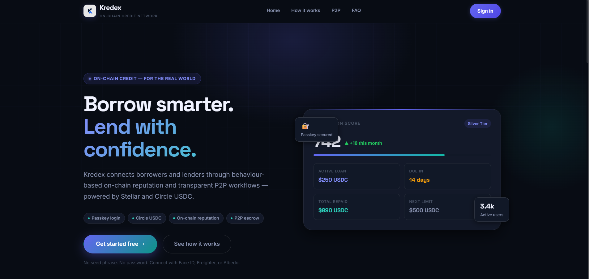
  <br/><em>Main Dashboard - The gateway to KRedex.</em>
</p>

### 🔐 Authentication
<p align="center">
  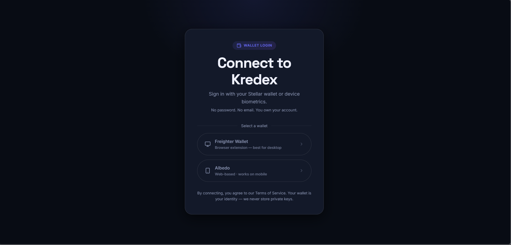
  <br/><em>Seamless Wallet and Passkey Authentication.</em>
</p>

### 👤 Borrower Dashboard
<p align="center">
  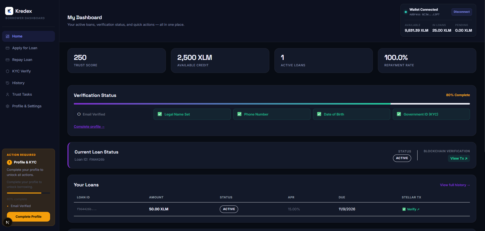
  <br/><em>Borrower Home - Quick overview of credit and active loans.</em>
</p>
<p align="center">
  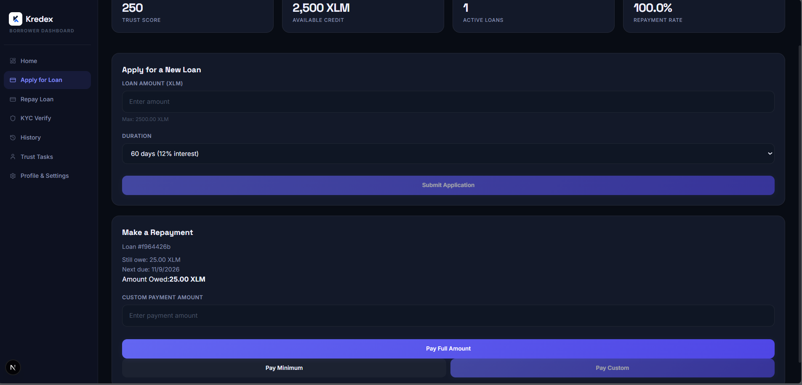
  <br/><em>Apply for a new loan directly on-chain.</em>
</p>
<p align="center">
  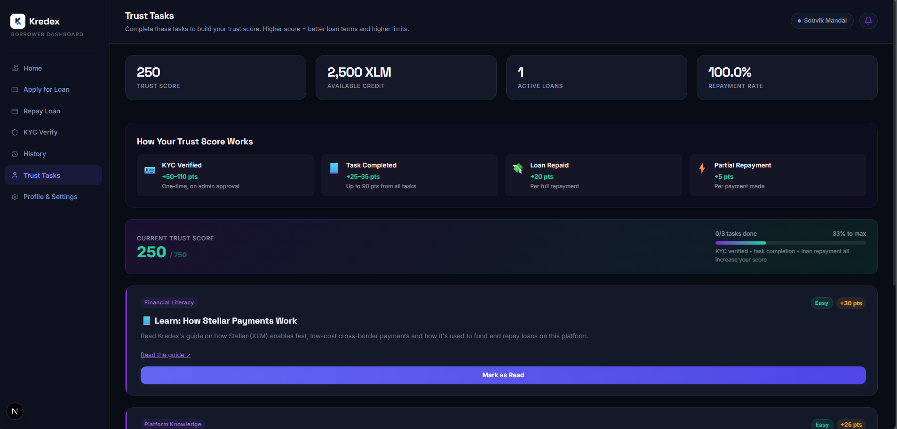
  <br/><em>On-chain Reputation and Trust Score management.</em>
</p>
<p align="center">
  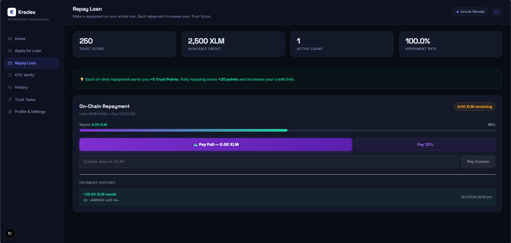
  <br/><em>Flexible repayment options through escrow.</em>
</p>
<p align="center">
  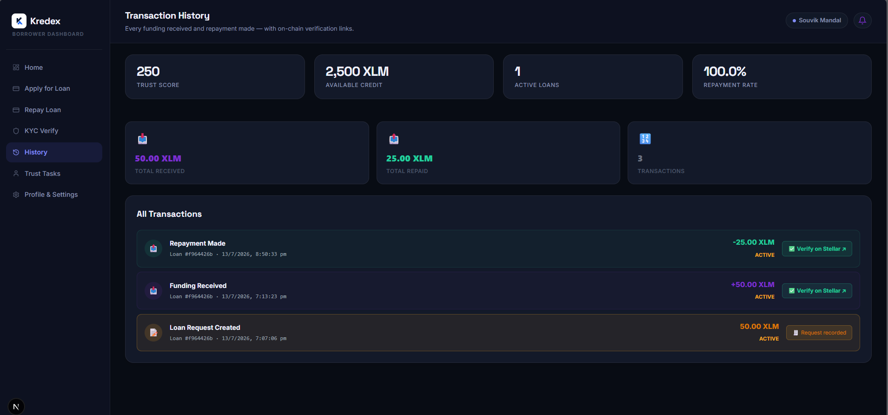
  <br/><em>Complete transaction history for the borrower.</em>
</p>
<p align="center">
  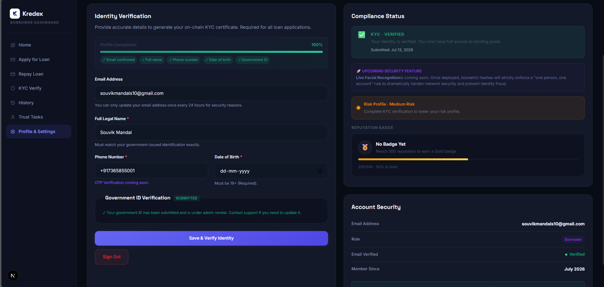
  <br/><em>Profile management and verification status.</em>
</p>

### 🏦 Lender Dashboard
<p align="center">
  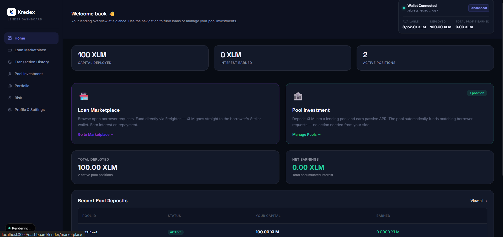
  <br/><em>Lender Home - Track your capital and yield.</em>
</p>
<p align="center">
  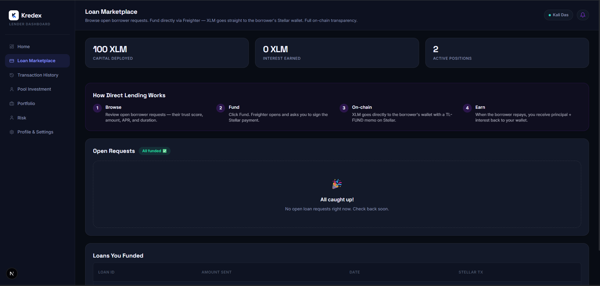
  <br/><em>Direct P2P Loan Marketplace for targeted investments.</em>
</p>
<p align="center">
  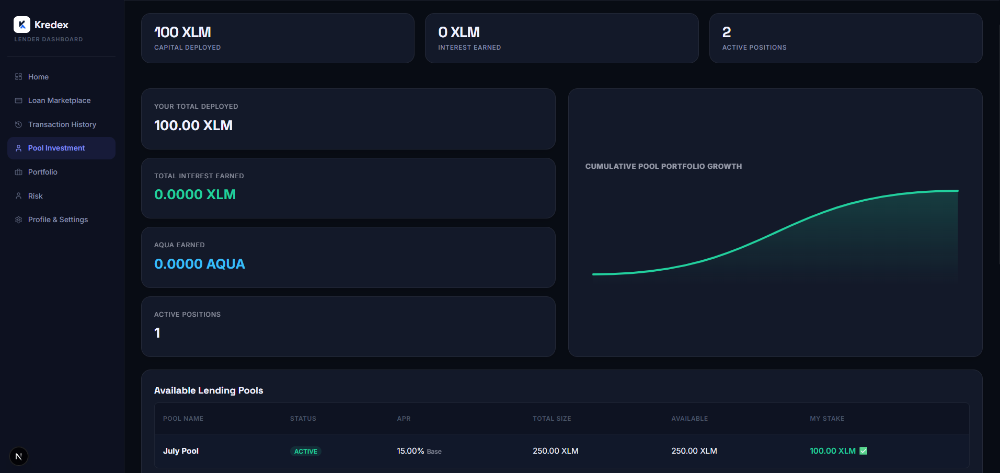
  <br/><em>Automated Liquidity Pools for diversified exposure.</em>
</p>
<p align="center">
  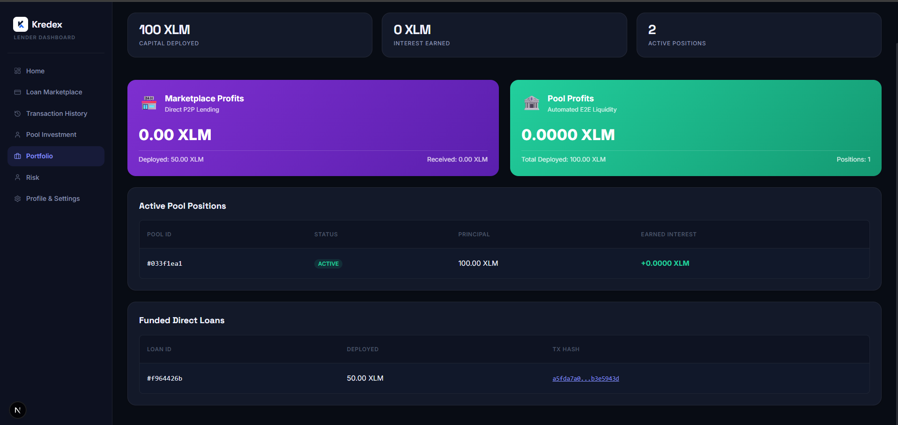
  <br/><em>Detailed breakdown of your lending portfolio and profits.</em>
</p>
<p align="center">
  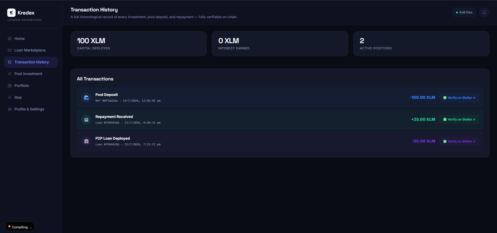
  <br/><em>Full chronological ledger of your deployed capital.</em>
</p>
<p align="center">
  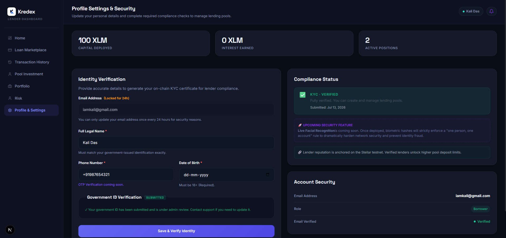
  <br/><em>Lender settings and configuration.</em>
</p>

### 🛡️ Admin & Treasury
<p align="center">
  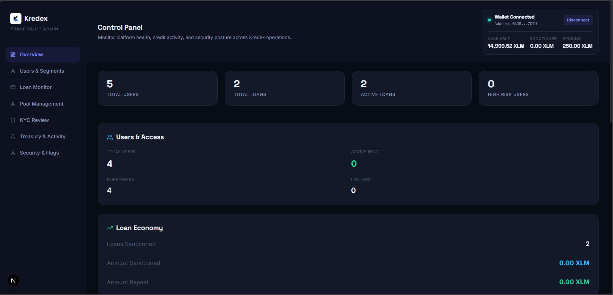
  <br/><em>Admin Overview - Platform health and key metrics.</em>
</p>
<p align="center">
  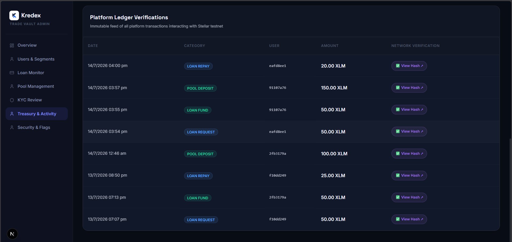
  <br/><em>Global treasury movement and transaction volume.</em>
</p>
<p align="center">
  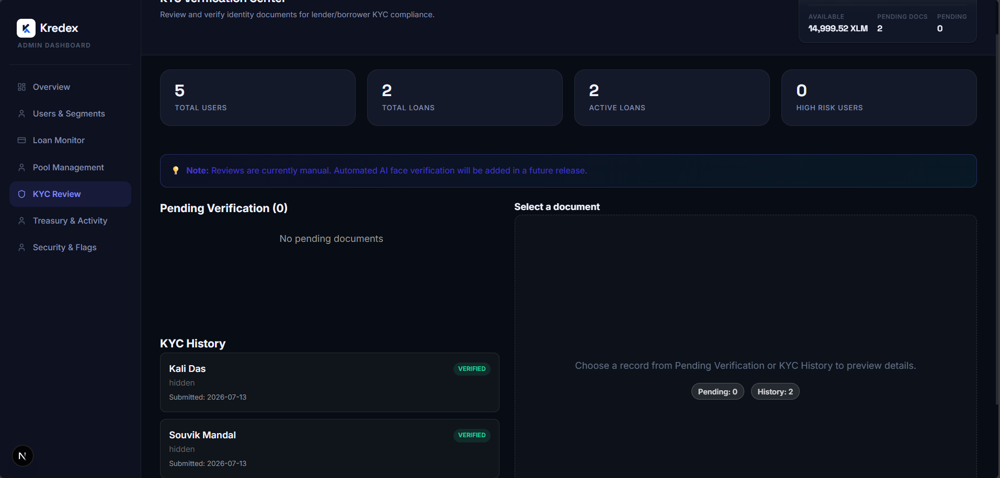
  <br/><em>SEP-12 compliance and identity verification review.</em>
</p>
<p align="center">
  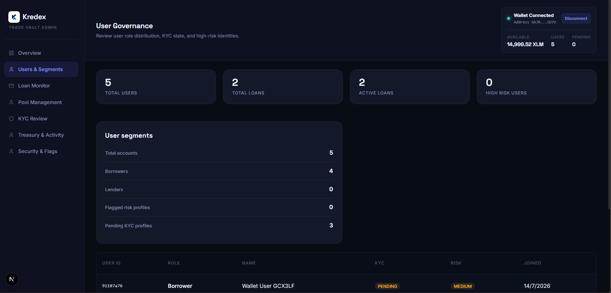
  <br/><em>User management and platform segmentation.</em>
</p>

### Analytics 

<p align="center">
  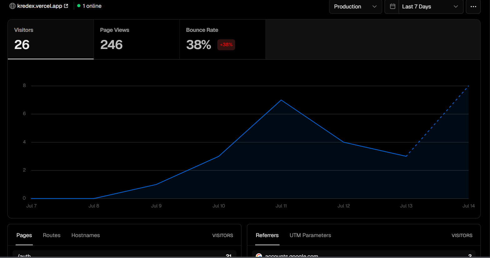
  <br/><em>Traffic on the website</em>
</p>

### 📱 Mobile Experience
<p align="center">
  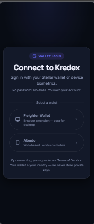
  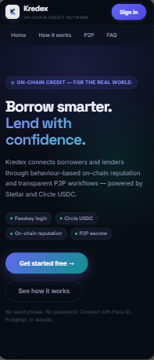
  <br/><em>Responsive mobile experience for lending on the go.</em>
</p>

---

## 🛠️ Tech Stack Details

| Category | Technology | Description |
| :--- | :--- | :--- |
| **Frontend** | Next.js 16, React 19 | App Router, Server Actions, modern UI components. |
| **Styling** | Tailwind CSS 4 | Utility-first styling for beautiful responsive design. |
| **Backend & DB** | Supabase, PostgreSQL | User authentication, relational data, and RLS. |
| **Caching** | Upstash Redis | High-speed caching for reputation scores and RPC requests. |
| **Blockchain** | Stellar SDK, Freighter | Native Stellar network integration and wallet signing. |
| **Smart Contracts** | Soroban (Rust) | WASM-compiled contracts for core lending logic and escrow. |

---

## 🔗 Stellar Blockchain Integration

KRedex heavily utilizes the Stellar network for its unprecedented speed and microscopic transaction fees. 
- **Soroban Smart Contracts:** Deployed natively on Stellar Testnet for executing decentralized logic (Reputation, Escrow, Lending).
- **Stellar Assets:** Uses native XLM for loans, repayments, and liquidity pools.
- **SEP-12 KYC Integration:** Native compliance out-of-the-box for all user onboarding.
- **Account Abstraction:** Smart Account Kit integration for seamless, passwordless passkey transactions.

---

## 📂 File Architecture

```text
kredex/
├─ app/                    # Next.js App Router (Pages, APIs, Server Actions)
│  ├─ api/                 # API Routes (KYC, Loans, Notifications)
│  ├─ dashboard/           # Role-based dashboards (Admin, Borrower, Lender)
│  └─ globals.css          # Global styling
├─ components/             # Reusable React UI components
│  ├─ dashboard/           # Dashboard specific widgets (Metrics, Forms, Tables)
│  └─ ui/                  # Core UI elements (Buttons, Modals, Loaders)
├─ contracts/              # Soroban smart contracts (Rust)
│  ├─ borrower_reputation/ # Reputation scoring logic
│  ├─ reputation_nft/      # Soulbound NFT badges
│  ├─ lending/             # Core loan logic
│  └─ escrow/              # Funds security
├─ lib/                    # SDKs, utilities, and integrations
│  ├─ stellar/             # Stellar SDK helpers, Soroban wrappers
│  ├─ auth/                # Supabase session and authorization
│  └─ prisma.ts            # Database client definition
├─ prisma/                 # Prisma ORM schema and migrations
├─ public/                 # Static assets (Logos, Fonts, Images)
└─ types/                  # Shared TypeScript interfaces and types
```

---

## 🗺️ Project Workflows

### Core Platform Architecture
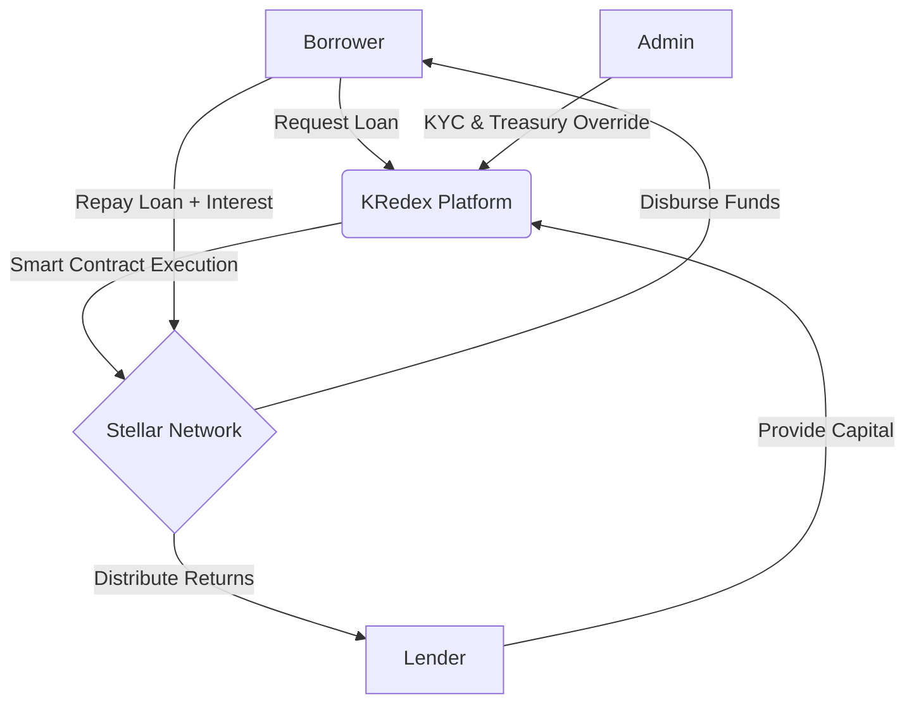
```mermaid
graph TD
  A[Borrower] -->|Request Loan| B(KRedex Platform)
  C[Lender] -->|Provide Capital| B
  B -->|Smart Contract Execution| D{Stellar Network}
  D -->|Disburse Funds| A
  A -->|Repay Loan + Interest| D
  D -->|Distribute Returns| C
  E[Admin] -->|KYC & Treasury Override| B
```

### User Transaction Flow
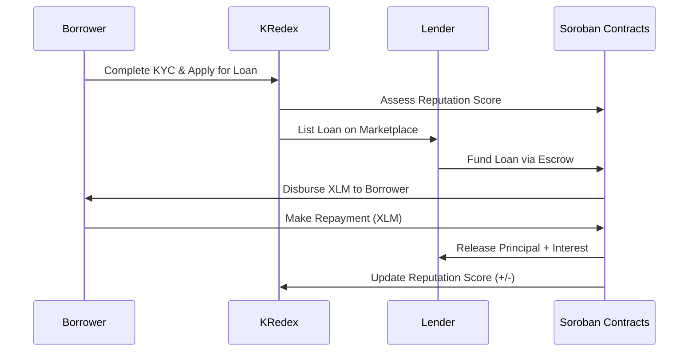
```mermaid
sequenceDiagram
  participant B as Borrower
  participant K as KRedex
  participant L as Lender
  participant S as Soroban Contracts
  
  B->>K: Complete KYC & Apply for Loan
  K->>S: Assess Reputation Score
  K->>L: List Loan on Marketplace
  L->>S: Fund Loan via Escrow
  S->>B: Disburse XLM to Borrower
  B->>S: Make Repayment (XLM)
  S->>L: Release Principal + Interest
  S->>K: Update Reputation Score (+/-)
```

---

## ✨ Features

| Feature | Description |
| :--- | :--- |
| **On-Chain Reputation** | Dynamic scoring where good borrowers earn reputation points tracked on Soroban. |
| **Soulbound NFTs** | High-reputation users receive non-transferable NFT badges (Gold/Platinum). |
| **Automated Liquidity Pools** | Lenders can deposit into automated pools for instant yield diversification. |
| **Stellar Disbursement** | Admins can fund up to 500 approved loans at once using the SDP engine. |
| **Passwordless Auth** | Login seamlessly using biometric Passkeys or Freighter wallet signatures. |
| **SEP-12 KYC Integration** | Out-of-the-box compliance acting as a native Stellar KYC server. |

---

## 📜 Smart Contracts

| Contract Name | Contract ID (Stellar Testnet) | Verification | Functionality |
| :--- | :--- | :--- | :--- |
| **Reputation** | `CCICPDIYJIRTMWSXSTLDBTEQXBIMALBLHODQJ62FAKSU3TKEFWBB4EZ7` | [🔗 Verify](https://stellar.expert/explorer/testnet/contract/CCICPDIYJIRTMWSXSTLDBTEQXBIMALBLHODQJ62FAKSU3TKEFWBB4EZ7) | Tracks user credit scores natively on-chain. |
| **Escrow** | `CBDVGF5KYW2SWP5XYIDNCQXSWDG7UYFXAR75SCOHTWDM3KR5NNZNR22S` | [🔗 Verify](https://stellar.expert/explorer/testnet/contract/CBDVGF5KYW2SWP5XYIDNCQXSWDG7UYFXAR75SCOHTWDM3KR5NNZNR22S) | Secures lender funds and manages collateral routing. |
| **Lending** | `CATWVUHA7SFVCAR4OTA7GXM4LOLCFSTXEXHMINM2BZYUCELWQG46BEBP` | [🔗 Verify](https://stellar.expert/explorer/testnet/contract/CATWVUHA7SFVCAR4OTA7GXM4LOLCFSTXEXHMINM2BZYUCELWQG46BEBP) | Core loan logic, interest calculation, and repayment terms. |
| **Default Mgmt** | `CACK4Q7YAXC3UTDJ74ERT54FUBXJJ5ZH73GL2S4WPM3Y6MOYZE2QUUZ5` | [🔗 Verify](https://stellar.expert/explorer/testnet/contract/CACK4Q7YAXC3UTDJ74ERT54FUBXJJ5ZH73GL2S4WPM3Y6MOYZE2QUUZ5) | Handles liquidation thresholds and insurance payouts. |

*You can verify transactions and state for these contracts using the [Stellar Expert Testnet Explorer](https://stellar.expert/explorer/testnet).*

---

## 🛑 Error Handling

| Error Type | Detection Mechanism | Resolution / Fallback |
| :--- | :--- | :--- |
| **RPC Rate Limiting** | Next.js API interceptors catch `429 Too Many Requests`. | Upstash Redis caches RPC reads; exponential backoff implemented for writes. |
| **Soroban Execution Failure** | Freighter/Albedo rejects signature or contract panics. | Rollback Prisma database state; display user-friendly toast notification. |
| **Insufficient Liquidity** | Pool withdraw API checks balance before transaction. | Graceful UI rejection; alerts admin to rebalance treasury. |
| **KYC Verification Failed** | SEP-12 API webhook returns `REJECTED` status. | Locks borrower loan requests; prompts user to re-submit documents. |

---

## 🧪 Testing Guide

To test the KRedex platform locally:
1. **Prisma Studio**: Run `npx prisma studio` to view database tables and manipulate mocked data.
2. **E2E Seed**: Run `npm run e2e:seed` to populate the database with test borrowers, lenders, and active loans.
3. **Freighter Wallet**: Ensure your Freighter wallet is set to **Testnet** and funded via the Stellar Laboratory friendbot.

### Testing Screenshots
<p align="center">
  
  
  <br/><em>Automated E2E seeding and testing interface.</em>
</p>

---

## ⚙️ Project Setup Guide

**1. Prerequisites**
- Node.js 18+
- Rust toolchain (`rustup target add wasm32-unknown-unknown`)
- [Stellar CLI](https://developers.stellar.org/docs/build/smart-contracts/getting-started/setup)

**2. Install Dependencies**
```bash
npm install
```

**3. Environment Configuration**
Copy `.env.example` to `.env.local` and populate the necessary Supabase, Redis, and Stellar keys.

**4. Database Setup**
```bash
npx prisma generate
npx prisma db push
```

**5. Run the Application**
```bash
npm run dev
```

---

## 🚀 Future Implementation on Mainnet

As KRedex transitions to the Stellar Mainnet, the following implementations are planned:
- **Fiat On/Off Ramps:** Integration with MoneyGram Access for seamless cash-to-crypto onboarding.
- **Stablecoin Integration:** Defaulting loans to USDC to mitigate XLM price volatility for borrowers and lenders.
- **Decentralized Oracles:** Real-time interest rate adjustments based on global macro-economic data feeds via Soroban oracles.
- **Institutional Liquidity Pools:** Permissioned pools designed for institutional lenders with customized compliance requirements.

---

*Thank you for the opportunity. Love Building! ❤️*
